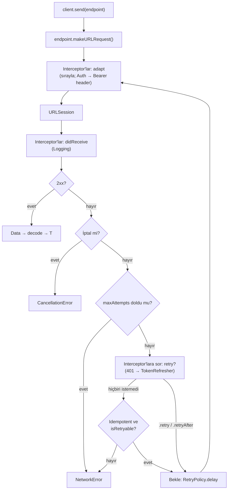

# Courier

Swift için async/await tabanlı, bağımlılığı olmayan HTTP istemcisi.

Tip güvenli endpoint'ler, zincirlenebilir interceptor'lar, üstel backoff ile
retry ve **aynı anda kaç istek 401 alırsa alsın tek bir token yenilemesi**.

- iOS 16+ / macOS 13+
- Swift 6 (strict concurrency)
- Sıfır bağımlılık

## Kurulum

Swift Package Manager ile, `Package.swift` içinde:

```swift
dependencies: [
    .package(url: "https://github.com/aysetakir/Courier.git", from: "1.0.0")
]
```

Xcode'da: **File → Add Package Dependencies…** → `https://github.com/aysetakir/Courier.git`

## Kullanım

### 1. Endpoint tanımla

Bir API ucunu `Endpoint` ile tarif et. Varsayılanı olan alanları (`method`,
`headers`, `queryItems`, `body`, `requiresAuthentication`) yalnızca
değiştirmen gerektiğinde yaz.

```swift
import Courier

enum UserAPI: Endpoint {
    case profile(id: String)
    case search(query: String)
    case update(id: String, name: String)
    case login(email: String, password: String)

    var baseURL: URL { URL(string: "https://api.example.com")! }

    var path: String {
        switch self {
        case .profile(let id), .update(let id, _): return "/users/\(id)"
        case .search:                               return "/users/search"
        case .login:                                return "/auth/login"
        }
    }

    var method: HTTPMethod {
        switch self {
        case .profile, .search: return .get
        case .update:           return .patch
        case .login:            return .post
        }
    }

    var queryItems: [URLQueryItem]? {
        guard case .search(let query) = self else { return nil }
        return [URLQueryItem(name: "q", value: query)]
    }

    var body: RequestBody? {
        switch self {
        case .update(_, let name):
            return .json(["name": name])
        case .login(let email, let password):
            return .form(["email": email, "password": password])
        case .profile, .search:
            return nil
        }
    }

    var requiresAuthentication: Bool {
        if case .login = self { return false }
        return true
    }
}
```

### 2. İstemciyi kur

```swift
let store = InMemoryTokenStore() // uygulamada kendi Keychain deponu ver

let refresher = TokenRefresher(store: store) { refreshToken in
    // Sunucudan yeni token al — bu closure aynı anda yalnızca bir kez çalışır.
    try await authService.refresh(using: refreshToken)
}

let client = HTTPClient(
    interceptors: [
        AuthInterceptor(refresher: refresher),
        LoggingInterceptor(),            // sonda: Authorization'ı da görsün (maskeli)
    ],
    retryPolicy: .default                // 3 deneme, 0.5 sn'den başlayan backoff
)
```

### 3. İstek at

```swift
let user: User = try await client.send(UserAPI.profile(id: "42"))
```

Hatalar `NetworkError` olarak gelir ve sunucunun gövdesini korur:

```swift
do {
    let user: User = try await client.send(UserAPI.profile(id: "42"))
} catch NetworkError.server(let statusCode, let data) {
    print(statusCode, String(decoding: data, as: UTF8.self))
} catch NetworkError.decoding(let error, let raw) {
    print(error, String(decoding: raw, as: UTF8.self))
} catch is CancellationError {
    // Ekran kapandı, sessizce geç.
}
```

| Hata | Ne zaman | Tekrar denenir mi? |
|---|---|---|
| `.transport` | Bağlantı yok, zaman aşımı… | Evet (idempotent metotlarda) |
| `.server(statusCode:data:)` | 2xx dışı yanıt | 408, 429, 500, 502, 503, 504 |
| `.unauthorized` | 401 | `AuthInterceptor` token'ı yenileyip bir kez |
| `.decoding(_:raw:)` | Gövde modele uymadı | Hayır |
| `.invalidURL`, `.encoding`, `.invalidResponse` | İstek kurulamadı / yanıt HTTP değil | Hayır |

İptal `NetworkError` değildir: `Task.cancel()` her zaman `CancellationError`
olarak gelir ve asla tekrar denenmez.

### Kendi token deponu yazmak

```swift
struct KeychainTokenStore: TokenStore {
    func token() async throws -> AuthToken? { /* Keychain'den oku, JSONDecoder */ }
    func save(_ token: AuthToken) async throws { /* JSONEncoder, Keychain'e yaz */ }
    func clear() async throws { /* sil */ }
}
```

`AuthToken` `Codable` olduğu için Keychain'e `Data` olarak yazılabilir.

### Kendi interceptor'ını yazmak

Üç metodun da varsayılanı var; yalnızca ihtiyacın olanı yaz.

```swift
struct AppVersionInterceptor: RequestInterceptor {
    func adapt(_ request: URLRequest, for endpoint: any Endpoint) async throws -> URLRequest {
        var request = request
        request.setValue("1.4.0", forHTTPHeaderField: "X-App-Version")
        return request
    }
}
```

## Mimari



| Katman | Dosya | Görevi |
|---|---|---|
| Core | `Endpoint`, `HTTPClient`, `NetworkError` | İsteği kur, gönder, sonucu çevir |
| Interceptors | `AuthInterceptor`, `LoggingInterceptor` | İsteğe takılıp çıkarılabilir davranış |
| Retry | `RetryPolicy` | Kaç kez, ne kadar bekleyerek |
| Auth | `TokenStore`, `TokenRefresher` | Token'ı sakla, tek seferde yenile |

Her denemede istek **ham halinden yeniden** adapt edilir: token yenilendiyse
yeni `Authorization` header'ı tekrar giden isteğe girer.

## Tasarım kararları

### Single-flight token yenileme

Uygulama açılırken 5 ekran aynı anda istek atar, token'ın süresi dolmuştur ve
5 istek birden 401 alır. Saf bir çözüm 5 kez refresh çağırır; çoğu sunucuda
refresh token tek kullanımlıktır, 2. çağrı itibarıyla kullanıcı oturumdan atılır.

`TokenRefresher` bir actor ve devam eden yenilemeyi bir `Task` olarak saklar:

```swift
let task = Task { try await refreshAction(current.refreshToken) }
refreshTask = task           // 1. önce ata
defer { refreshTask = nil }  // 3. başarı da hata da olsa temizle
return try await task.value  // 2. sonra bekle
```

- **Önce ata, sonra bekle.** Tersi olsaydı bekleme anında gelen çağrılar
  alanı boş görüp kendi yenilemelerini başlatırdı.
- **`defer` ile temizle.** Yoksa patlamış task sonsuza dek döner, uygulama bir
  daha token yenileyemez.
- **Actor reentrancy.** Actor veri yarışını önler, mantıksal yarışı önlemez:
  `await store.token()` beklenirken actor başka çağrılara açıktır. Bu yüzden
  `await` sonrasında `refreshTask` yeniden kontrol edilir.
- **Geç gelen 401.** İlk istek token'ı yeniledikten sonra 401 alan istek,
  depoda artık reddedilenden farklı bir token bulur ve yeniden yenilemez.

Bunu kanıtlayan test 5 eşzamanlı çağrı yapar ve refresh'in **tam 1 kez**
çalıştığını doğrular (`TokenRefresherTests`, `AuthInterceptorTests`).
Refresh'e yapay gecikme konur; yoksa yenileme diğer çağrılar gelmeden biter ve
test yanlış sebepten yeşil olur.

### Backoff ve jitter

Sunucu çöktüğünde 10.000 cihaz aynı anda hata alır. Hepsi sabit 1 sn sonra
tekrar denerse sunucu, ayağa kalktığı anda aynı dalgayla tekrar düşer
(*thundering herd*).

```
gecikme = min(baseDelay × 2^(deneme-1), maxDelay)   → 0.5, 1, 2, 4, 8, 8…
jitter  = rastgele [gecikme × (1 - jitter), gecikme]
```

- **Üstel artış** sunucuya toparlanma süresi verir.
- **Jitter** cihazları zamana yayar.
- Jitter **yalnızca aşağı** sapar; böylece `maxDelay` hiçbir zaman aşılmaz.

### Hangi istekler tekrar denenir?

- **İdempotent olmayan metotlar (POST, PATCH) otomatik tekrar denenmez.**
  500 alan bir POST sunucuda işlenmiş olabilir; tekrarı çift kayıt demek.
- **401 istisnadır:** sunucu isteği işlemeden reddetmiştir, `AuthInterceptor`
  POST'u da güvenle tekrarlar.
- **`maxAttempts` interceptor'ları da bağlar:** hatalı bir interceptor sonsuz
  döngü kuramaz.

### Ham gövde saklanır

`.server` ve `.decoding` hataları sunucudan gelen `Data`'yı taşır. API'nin asıl
hata mesajı ("email already registered") gövdededir; decode hatasını ayıklamanın
tek yolu da gelen veriyi görmektir.

### `HTTPClient` neden actor değil?

Tüm alanları `let`; korunacak değişken durum yok. Actor olsaydı her çağrıya
gereksiz bir atlama eklerdi. Değişken durum olan yerde (`TokenRefresher`,
`InMemoryTokenStore`) actor kullanıldı.

### Loglama

`print` değil `OSLog`: seviyeye göre filtrelenir, Console.app'te kategoriyle
aranır. `Authorization`, `Cookie` gibi header'lar maskelenir. İsteği cURL komutu
olarak basmak (`logsCURL: true`) gövdeyi — örneğin login parolasını — içerdiği
için varsayılan olarak kapalıdır.

## Neden Alamofire değil?

Alamofire olgun ve kapsamlı; çoğu ekip için doğru seçim. Courier'in var olma
sebebi farklı:

| | Alamofire | Courier |
|---|---|---|
| Boyut | Büyük, geniş özellik seti | ~700 satır, okunabilir |
| Concurrency | Callback temelli, async/await sonradan eklendi | Baştan async/await, Swift 6 strict concurrency |
| Token yenileme | `AuthenticationInterceptor` | Actor + `Task` ile single-flight, test edilmiş |
| Bağımlılık | Dış paket | Yalnızca Foundation |
| Amaç | Her senaryoyu karşılamak | Bir ağ katmanının nasıl çalıştığını göstermek |

Courier; `URLSession`'ın üzerine, gerçek bir uygulamada gerekecek parçaları
(retry, auth, loglama) eklemenin ne kadar kod gerektirdiğini ve hangi eşzamanlılık
tuzaklarının olduğunu göstermek için yazıldı. Multipart upload, sertifika
sabitleme (pinning), önbellek gibi ihtiyaçlar varsa Alamofire'ı tercih et.

## Testler

```bash
swift test
```

Testler ağa çıkmaz: `MockURLProtocol`, gerçek `URLSession` kod yolunu çalıştırıp
sahte yanıt döndürür. Böylece `URLSession`'ı protokolle sarmalamaya gerek kalmaz.

## Yol haritası

- [x] v0.1 — `Endpoint`, `URLRequest` üretimi, `HTTPClient`, hata taksonomisi, `URLProtocol` ile testler
- [x] v1.0 — Interceptor zinciri, auth header, single-flight token refresh, retry + backoff, loglama
- [ ] Sonrası — Multipart upload, `Retry-After` header desteği, Keychain token deposu örneği
